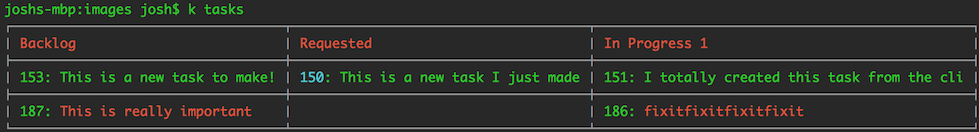

A cli for Kanbanize, so I don't have to go use the web UI for frequent operations.

What are my frequent operations, you ask?  Well, let me tell you!

- I look at the tasks assigned to me, and see which column they're in
- I add to the checklists of my tasks
- I check things off of those checklists
- I move tasks to other columns (hopefully to the right) when appropriate

Other people will likely have other workflows than me.  For now, this software represents my normal interactions with Kanbanize - but it could represent yours too!  Pull requests or issues or whatever are welcome.  If you hate or have otherwise strong emotions about the app, [be sure to tell me on Twitter](https://twitter.com/TehShrike).

# Install

Install [node.js](http://nodejs.org/download/) if it's not already on your machine, and then run

	sudo npm install -g kanbanize-cli

(you'll obviously want to skip the sudo if you're on Windows)

# Set up

`k set key [api key]`  The API key you can get from the web ui, from the top-right menu dropdown under "API"

`k set domain [domain name]`  The domain name where you visit Kanbanize.  Could be company-specific, may just be kanbanize.com

`k set board [board id]`  The board you want to interact with.  You can get this from the dashboard, by mousing-over the right side of the list of boards, or you can just grab it from the url when you open up the board.

`k set user [username]`  Your username.  Case sensitive.  This is used to filter down tasks so that you'll just see the ones that are assigned to you.  If you want to see all jobs, set to "all".

`k set columns [column names]`  A comma-separated list of column names from the board.  Case sensitive.  Only tasks in these columns will be displayed.  If you want to try to fit all the columns in your terminal, set to "all".

`k set editor [editor]`  Your favorite terminal editor for editing task descriptions or adding long comments.  Example: `k set editor vim`

If you want to check the current value of any of the settings above, you can see it by typing `k get [setting name]`.

# Usage

To refresh your memory on usage from the command-line, just run `k` and it will echo out the cheat sheet.

## View your tasks

`k tasks`

## Add a task

`k add task [template name] [task title]`

New tasks go into the backlog.  The template name is case sensitive.

## Select a task

`k work [task id]`

Sets the "current" task being worked.  This task id will be used for all other task-specific commands when you don't specify the task id manually.

## View task details

`k details [OPTIONAL task id]`

Spits out the task description, all comments, and all subtasks.

## Edit the task description

`k description [OPTIONAL task id]`

Opens your selected editor to make changes to the description.  Text-only, any HTML styling previously on the task will be lost.

## View subtasks

`k subtasks [OPTIONAL task id]`

If you don't type in the task id, subtasks will be shown for whatever task you said you were working.

## Add a subtask

`k add subtask [subtask title]`

## Mark a subtask as completed

`k complete [subtask id]`

## Add a comment

`k add comment [OPTIONAL comment]`

If you don't type in the comment text on the command-line, your editor will open and whatever you save there will be added as a new comment on the task.

## Move a task to a different column

`k move [left|right] [OPTIONAL taskid]`

## Block or unblock a task

`k block [reason]`

`k unblock [OPTIONAL task id]`

## Run arbitrary functions against the API

`k api [api function] [header1 value1 [header2 value2 ...]]`

Run any of the [Kanbanize API functions](https://kanbanize.com/ctrl_integration) you like and view the resulting JSON.  Your API key and the current board id will be automatically passed in to every call.

# License

[WTFPL](http://wtfpl2.com/)

So, you know, do whatever you want!  Which is what you would have done anyway, unless I seemed like a guy who could afford lots of lawyers.  (I'm not)
